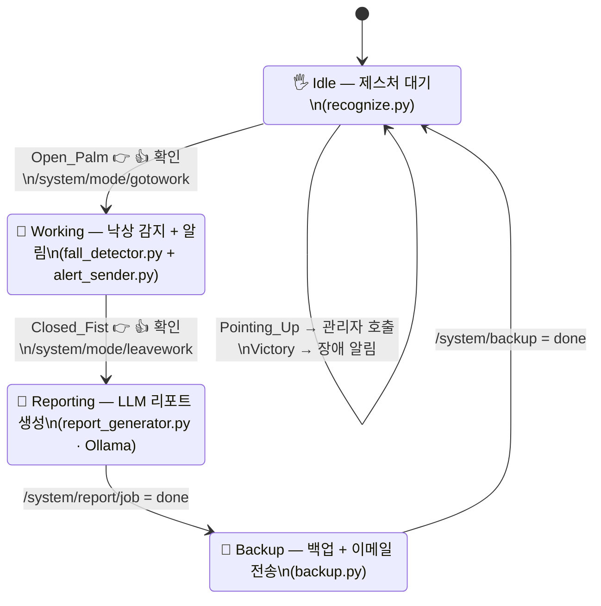

# 🎥 Watchful

**산업현장 근로자 안전 모니터링 시스템 — 손동작 핫키로 근무 상태를 기록하고, 낙상을 실시간 감지해 알리는 라즈베리파이 스마트캠**

낙상 발생 시 관리자에게 텔레그램으로 즉시 알림을 보내고, 하루 근무 종료 시 로컬 LLM(Ollama)이 그날의 자세·이벤트 데이터를 분석해 관리자용/근로자 건강관리용 리포트를 각각 생성한 뒤 SMTP 메일 발송·백업까지 자동으로 수행합니다.

---

## 📋 목차

- [개요](#-개요)
- [기술 스택](#-기술-스택)
- [시스템 흐름](#-시스템-흐름)
- [핵심 로직](#-핵심-로직)
- [폴더 구조](#-폴더-구조)
- [환경 변수](#-환경-변수)
- [참고](#-참고)

---

## 📖 개요

Raspberry Pi 5 + Hailo-8L AI 가속기 기반의 **산업현장 근로자 안전 모니터링 시스템**입니다. 손동작을 일종의 **핫키(hotkey)**로 사용해 출근·퇴근·관리자 호출·장애 알림 같은 근무 상태를 손쉽게 기록하고, 근무 중에는 카메라로 근로자의 자세를 실시간 분석해 **낙상을 자동 감지**합니다. 낙상 발생 시 스냅샷과 함께 관리자에게 텔레그램으로 즉시 알림을 보내고, 퇴근 시점에는 하루 동안 누적된 자세·이벤트 데이터를 로컬 LLM(Ollama)이 분석해 **관리자용 안전 분석 리포트**와 **근로자용 건강관리 리포트**를 각각 생성합니다. 이후 관리자 데이터는 원격 서버로 백업하고, 근로자 리포트는 **SMTP 메일**로 발송하는 것까지 하나의 파이프라인으로 자동화되어 있습니다.

전체 프로세스는 C++로 작성된 오케스트레이터(`pm.cpp`)가 MQTT 토픽을 구독하며 각 단계(Python 스크립트)를 순서대로 시작/종료시키는 상태 머신 구조로 동작합니다.

---

## 🛠 기술 스택

| 영역 | 사용 기술 |
|---|---|
| 하드웨어 | Raspberry Pi 5, Hailo-8L AI 가속기, USB/CSI 카메라 |
| 언어 | Python 3 (인지·알림·리포트·백업), C++ (프로세스 오케스트레이터) |
| 제스처 인식 | MediaPipe Gesture Recognizer, OpenCV |
| 자세/낙상 추정 | Hailo YOLO Pose Estimation (GStreamer 파이프라인, `hailo_apps`) |
| 메시징 | MQTT (`paho-mqtt`, Eclipse Paho C++) — 로컬 브로커 + 원격 브로커 포워딩 |
| 리포트 생성 | Ollama 로컬 LLM (`gemma3:1b-it-qat`) |
| 알림 | Telegram Bot API (`requests`) — 관리자용 |
| 사용자 리포트 발송 | SMTP (`smtplib`) — 이메일 |
| 음성 피드백 | gTTS + `mpg123` |

---

## 🔄 시스템 흐름

`pm.cpp`가 MQTT 토픽을 기준으로 아래 4단계를 순환시키는 상태 머신입니다.

MQTT 토픽 상세

| 토픽 | 발행 주체 | 의미 |
|---|---|---|
| `/system/mode/gotowork` | `recognize.py` | 출근 확정 → `pm.cpp`가 낙상 감지 파이프라인 시작 |
| `/system/mode/leavework` | `recognize.py` | 퇴근 확정 → `pm.cpp`가 전체 종료 후 리포트 생성 시작 |
| `/system/msg` | `recognize.py` | 관리자 호출 / 장애 발생 즉시 알림 |
| `/system/button` | (물리 버튼) | Idle(제스처 인식) 화면으로 강제 복귀 |
| `/system/camera/capture` | (외부) | `fall_detector.py`에 수동 스냅샷 요청 |
| `/system/report/job` | `report_generator.py` | 리포트 생성 완료(`done`) → `pm.cpp`가 백업 시작 |
| `/system/backup` | `backup.py` | 백업 완료(`done`) → `pm.cpp`가 Idle로 복귀 |

---

## 🧠 핵심 로직

<b>1. 제스처 기반 모드 선택 (recognize.py)</b>

- **MediaPipe Gesture Recognizer**로 손 제스처를 인식하고, 오인식 방지를 위해 동일 제스처 반복 시 0.8초 디바운스 적용
- `Open_Palm`(출근) / `Closed_Fist`(퇴근) / `Pointing_Up`(관리자 호출) / `Victory`(장애 알림) 트리거 제스처 후, `Thumb_Up`/`Thumb_Down`으로 **음성 안내 + 재확인**하는 2단계 확인 절차를 거쳐 오작동을 방지
- 확인이 끝나면 gTTS로 한국어 음성 피드백을 재생하고, 로컬·원격 두 MQTT 브로커에 동시 발행

<b>2. 낙상 감지 (fall_detector.py)</b>

- Hailo YOLO Pose 파이프라인에서 사람 키포인트(엉덩이·어깨 등)를 받아 **속도 + 자세 하이브리드 알고리즘**으로 판정
- 엉덩이(hip) y좌표의 시간 변화율로 **낙하 속도**를 계산하고, 어깨~손목 범위의 **수직 분포(vertical spread)**를 EMA로 스무딩해 눕거나 쓰러진 자세인지 판단
- `standing → monitoring → fallen` 3단계 상태 머신: 급격한 속도 감지 후 일정 프레임 이상 수평 자세가 유지되면 `sudden_fall`, 천천히 눕는 경우도 `prolonged_horizontal`로 별도 감지
- `fallen → standing` 회복 시 별도의 `recovered` 이벤트를 기록해 오탐 후 재발생을 구분
- 낙상 확정 시 스냅샷(JPG) + job JSON을 저장하고, MQTT로 수동 캡처 요청도 동일한 방식으로 처리

<b>3. 알림 전송 (alert_sender.py)</b>

- `analysis_queue/`를 폴링하며 job JSON을 발견하면 한국어 관리자 알림 메시지를 구성해 **텔레그램**으로 전송 (스냅샷이 있으면 사진 첨부, 실패 시 텍스트로 폴백)
- `recovered` 이벤트는 사진 없이 텍스트 알림만 전송
- 처리된 job은 `processed_jobs/`로 이동시켜 중복 처리 방지

<b>4. LLM 기반 리포트 생성 (report_generator.py)</b>

- 하루 동안 쌓인 `processed_jobs/`의 이벤트를 집계해, **Ollama 로컬 LLM**(`gemma3:1b-it-qat`)에 프롬프트를 넘겨 두 종류의 리포트를 생성
  - **관리자 리포트**: 안전관리자/의료진 대상, fall→recovered 흐름과 원인 패턴 분석 + 행동 권고
  - **사용자 건강관리 리포트**: 숫자 나열 없이 쉬운 한국어로, 심리적 압박 없는 톤의 일상 실천 팁 중심 리포트
- 생성 완료 후 처리한 JSON을 `archived_jobs/`로 이동하고 MQTT로 `done` 발행

<b>5. 백업 & 이메일 전송 (backup.py)</b>

- 가장 최신 `wellness_report_*.txt`를 **SMTP**로 사용자에게 이메일 발송
- `archived_jobs`(JSON) + `admin_report_*.txt` + `fall_snapshots`를 하나의 `tar.gz`로 묶어 **scp**로 원격 백업 서버에 전송
- 전송이 **성공한 경우에만** 로컬 큐/리포트/스냅샷 디렉터리를 정리(삭제)해 실패 시 데이터 유실을 방지
- 전체 완료 후 MQTT `done` 발행 → `pm.cpp`가 Idle 상태로 복귀

<b>6. 프로세스 오케스트레이션 (pm.cpp)</b>

- 로컬/원격 두 MQTT 브로커에 연결해 시스템 상태 토픽을 구독하고, `fork`/`execl`로 각 Python 스크립트를 자식 프로세스로 실행·종료 관리
- 상태 전이마다 `stop_all()`로 이전 단계 프로세스를 정리한 뒤 다음 단계를 시작하는 **단일 활성 프로세스 원칙**으로 충돌을 방지
- 수신한 시스템 메시지를 원격 브로커로도 그대로 포워딩해, 다른 기기(예: 관리자 PC)에서도 동일한 상태를 관찰할 수 있게 함

---

## 📁 폴더 구조

| 파일 | 역할 |
|---|---|
| `pm.cpp` | 전체 파이프라인을 상태 머신으로 오케스트레이션하는 C++ 프로세스 매니저 |
| `recognize.py` | MediaPipe 제스처 인식 + TTS 음성 안내 + 모드 전환 MQTT 발행 |
| `fall_detector.py` | Hailo Pose 기반 낙상 감지 + 스냅샷/job 생성 + MQTT 수동 캡처 처리 |
| `alert_sender.py` | job 큐 폴링 → 텔레그램 관리자 알림 전송 |
| `report_generator.py` | Ollama LLM으로 관리자/사용자 리포트 각각 생성 |
| `backup.py` | 사용자 리포트 이메일 전송 + 관리자 데이터 원격 백업 + 로컬 정리 |
| `.env.example` | 필요한 환경 변수 키 목록 (값은 비워둠, 실제 값은 `.env`에 로컬로만 설정) |

---

## 🔑 환경 변수

민감한 값은 모두 `.env`(git에서 제외됨)에서 로드합니다. 필요한 키 목록은 `.env.example`을 참고해 로컬에 `.env`를 만들어 채워주세요.

| 변수 | 용도 |
|---|---|
| `TELEGRAM_BOT_TOKEN`, `TELEGRAM_CHAT_ID` | 관리자 알림용 텔레그램 봇 |
| `SMTP_SERVER`, `SMTP_PORT`, `SMTP_USER`, `SMTP_PASSWORD`, `SMTP_TO`, `SMTP_SUBJECT` | 사용자 건강관리 리포트 이메일 발송 |
| `MQTT_BROKER`, `MQTT_PORT` | 로컬 MQTT 브로커 접속 정보 |
| `BACKUP_REMOTE_HOST`, `BACKUP_REMOTE_USER`, `BACKUP_REMOTE_DIR` | 원격 백업 서버(scp) 접속 정보 |
| `OLLAMA_MODEL` | 리포트 생성에 사용할 Ollama 모델명 |

---

## 📝 참고

- `report_generator.py`, `backup.py`의 데이터 경로(`/home/pi/project/hailo-rpi5-examples/...`)는 특정 라즈베리파이 배포 환경에 맞춰 하드코딩되어 있어, 다른 환경에 배포할 경우 경로 수정이 필요합니다.
- `fall_detector.py`는 Hailo 리소스를 단독으로 점유하므로, 동시에 다른 프로세스에서 Hailo를 사용하지 않아야 합니다.
- 로컬 브로커 외에 원격 브로커(`192.168.0.59:1883`)로도 상태를 포워딩하도록 되어 있어, 관리자 PC 등에서 동일한 이벤트를 모니터링할 수 있습니다.
